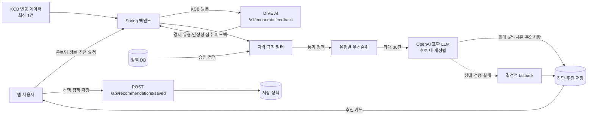

# 현재 정책 추천 아키텍처

이 문서는 2026-07-26 기준 Spring 백엔드의 실제 구현을 설명한다. 대상 독자는 앱·백엔드·발표 담당자이며, 추천 결과가 만들어지는 이유와 데이터 경계를 빠르게 확인할 수 있도록 작성했다.

## 한눈에 보기

현재 추천은 정책을 임의로 생성하는 방식이 아니다. 먼저 서버가 **승인된 정책 중 사용자의 명시 조건에 맞는 정책만** 후보로 남긴다. 그 뒤 경제 진단 유형에 맞는 카테고리 우선순위를 적용하고, LLM은 이 후보 안에서만 최대 5개를 재정렬하며 추천 이유와 주의사항을 작성한다.



## 입력과 데이터 출처

`POST /api/diagnose`는 로그인 사용자만 호출한다. 요청 본문에는 KCB 원문이나 신용점수를 직접 넣지 않고, 이미 저장된 **가장 최근 KCB 연동 데이터**를 사용한다. KCB 연동이 없으면 추천은 중단되고 `KCB_NOT_CONNECTED` 오류가 반환된다.

```json
{
  "userInputsOverride": {
    "age": 27,
    "regionCode": "26",
    "annualIncome": 32000000,
    "jobCode": "0013010",
    "schoolCode": "0049010",
    "marriageCode": "0055003"
  }
}
```

`userInputsOverride`는 선택 사항이다. 값이 없거나 빈 값인 조건은 필터에서 제한하지 않는다. 앱의 온보딩 값과 다르게 이번 추천에만 적용할 값을 보내는 용도다. `specializationCode` 필드는 요청 DTO에 존재하지만, **현재 후보 필터에는 아직 연결되어 있지 않다.**

| 정보 | 실제 출처 | 현재 용도 |
| --- | --- | --- |
| 경제 유형·안정성 점수 | KCB 최신 연동 레코드를 DIVE AI에 전달한 결과 | `취약형`/`안정형` 우선순위 선택, LLM 입력, 응답 표시 |
| 나이·지역·연소득·직업·학력·혼인 | `userInputsOverride` | 정책 자격 필터 |
| 정책 조건·설명 | 온통청년 원본을 동기화한 정책 DB | 자격 필터, 후보 정렬, LLM 근거 |

## 예시로 보는 추천 과정

다음은 설명을 위한 가상 데이터다. 정책번호와 조건은 실제 정책 데이터가 아니며, 처리 방식만 나타낸다.

### 1. 경제 진단

사용자의 최신 KCB 레코드를 백엔드가 DIVE AI의 `/v1/economic-feedback`에 전달한다. 응답 예시는 다음과 같다.

```json
{
  "composite_stability_score": 42.0,
  "economic_type": "E4",
  "economic_type_name": "주거비 부담형",
  "major_class": "취약"
}
```

경제 유형은 다음 순서로 `STABLE(안정형)` 또는 `VULNERABLE(취약형)`으로 변환한다. 이 유형은 정책 자격을 제한하지 않고 **후보의 우선순위에만** 반영한다.

| 우선순위 | DIVE AI 응답 | 변환 결과 |
| --- | --- | --- |
| 1 | `economic_type`가 `E1`, `E2`, `E3` | 안정형 |
| 1 | `economic_type`가 `E4`, `E5`, `E6` | 취약형 |
| 2 | 위 코드가 아니고 `major_class`가 `안정` | 안정형 |
| 2 | 위 코드가 아니고 `major_class`가 `취약` | 취약형 |
| 3 | 위 값을 모두 판정할 수 없음 | 점수 50 이하: 취약형 / 51 이상: 안정형 |

예시 응답의 `economic_type`가 `E4`라면, `major_class`와 무관하게 취약형으로 분류된다. 백엔드는 전체 AI 분석 응답, 점수, 경제 유형명, 대분류, 신뢰도를 최신 KCB 연동 레코드에 함께 저장한다.

### 2. 자격에 맞는 후보만 남기기

정책 DB에서 승인 상태 코드가 `0044002`인 정책을 모두 가져온다. 아래 조건을 모두 통과한 정책만 후보가 된다.

| 사용자 값 | 정책 필드 | 예시 판정 |
| --- | --- | --- |
| 27세 | `sprtTrgtMinAge`, `sprtTrgtMaxAge` | 19~34세이면 통과 |
| 연 3,200만 원 | `earnMinAmt`, `earnMaxAmt` | 0~4,000만 원이면 통과 |
| 지역 코드 `26` | `zipCd` | 정책 조건 문자열에 `26`이 있으면 통과 |
| 직업 코드 `0013010` | `jobCd` | 조건이 비었거나 해당 코드가 있으면 통과 |
| 학력 코드 `0049010` | `schoolCd` | 조건이 비었거나 해당 코드가 있으면 통과 |
| 혼인 코드 `0055003` | `mrgSttsCd` | 조건이 비었거나 해당 코드가 있으면 통과 |

직업·학력·혼인 조건에 각각 `0013010`, `0049010`, `0055003`가 포함된 정책은 제한 없음으로 보고 모든 입력값을 통과시킨다. 금액 필드는 쉼표를 제거한 뒤 처음 발견되는 숫자를 정수로 비교한다. 조건 필드가 비었거나 사용자가 해당 값을 보내지 않았으면 그 조건은 통과로 처리한다.

예를 들어 아래 세 정책이 있을 때, 앞의 사용자에게는 A와 C만 남는다.

| 정책 | 조건 | 결과 | 이유 |
| --- | --- | --- | --- |
| A. 청년 월세 지원 | 19~34세, 연소득 4,000만 원 이하, 부산 | 통과 | 나이·소득·지역 일치 |
| B. 취업준비 수당 | 18~29세, 연소득 2,500만 원 이하 | 제외 | 소득 상한 초과 |
| C. 금융 상담 지원 | 19~39세, 소득·지역 제한 없음 | 통과 | 모든 명시 조건 충족 |

`addAplyQlfcCndCn`(추가 자격)과 `ptcpPrpTrgtCn`(참여 제한)은 이 단계에서 완전한 규칙으로 해석하지 않는다. 후속 LLM에 함께 전달해 재정렬 근거로 사용하므로, 최종 신청 전에는 정책 상세 조건을 반드시 확인해야 한다.

### 3. 취약형/안정형에 맞춰 후보 정렬

자격 통과 후보는 사용자 유형에 따른 키워드 가중치 합계가 큰 순서로 정렬된다. 동점이면 조회 수 내림차순, 마지막으로 DB ID 오름차순을 사용한다. 최대 30건만 LLM에 전달한다.

| 사용자 유형 | 우선 키워드 예시 |
| --- | --- |
| 취약형 | 주거(10), 월세(9), 금융·복지(8), 대출·바우처(7), 건강·취업(5) |
| 안정형 | 창업(10), 교육·직업훈련(8), 역량(7), 자격·인턴·자산·적금·청약(6) |

키워드는 정책의 대·중분류, 키워드명, 정책명, 지원내용을 합친 문자열에서 찾는다. 따라서 예시의 취약형 사용자는 A(주거·월세)가 C보다 앞설 가능성이 크다. 이는 **자격 판정이 아니라 정렬 규칙**이다.

### 4. 후보 내에서만 LLM이 최종 순위를 작성

후보는 정책번호, 이름, 설명, 지원 내용, 추가 자격, 참여 제한과 함께 전달된다. 사용자 정보는 나이·소득의 정확한 수치 대신 구간(`20s`, `20m-40m-krw`)으로 전달하고, 지역·직업·학력·혼인 코드는 그대로 전달한다.

LLM은 아래 형식으로 최대 5개를 반환해야 한다.

```json
{
  "recommendations": [
    {
      "plcyNo": "EXAMPLE-A",
      "rank": 1,
      "reason": "주거비 부담 완화에 직접 도움이 되는 월세 지원 정책입니다.",
      "caution": "거주 기간과 실제 모집 기간을 신청 전에 확인하세요."
    }
  ]
}
```

서버는 응답의 정책번호가 전달한 후보 목록에 실제로 있는지 다시 검사하고, 중복을 제거한 뒤 순위 순으로 최대 5건만 저장한다. 따라서 LLM이 후보 밖 정책을 만들어도 응답에 포함되지 않는다.

### 5. LLM을 쓸 수 없을 때

API 키 누락, 네트워크 오류, JSON 형식 오류, 후보 밖 정책번호만 반환한 경우에는 예외를 사용자에게 노출하지 않는다. 앞 단계에서 정렬한 후보의 상위 5건을 그대로 추천하고 다음과 같은 정해진 문구를 채운다.

- 사유: `취약형 사용자에게 주거 지원 조건이 맞을 수 있어요.`처럼 사용자 유형과 정책 대분류를 결합
- 주의사항: `신청 전 세부 자격과 신청 기간을 확인하세요.`

따라서 LLM 장애 시에도 **자격 조건을 통과한 정책만** 반환된다.

## 컴포넌트 책임

| 컴포넌트 | 책임 |
| --- | --- |
| `RecommendationController` | `/api/diagnose` 요청을 로그인 사용자 기준으로 전달 |
| `DiagnoseService` | 경제 진단 호출, 자격 필터, 후보 정렬, 재정렬·저장 전체 오케스트레이션 |
| `DiveAiClient` | 저장된 KCB 레코드를 DIVE AI `/v1/economic-feedback`으로 전달 |
| DIVE AI | KCB 기반 경제 유형·안정성 점수·피드백 산출 |
| 정책 DB | 온통청년 동기화 정책과 승인 상태·자격 조건 제공 |
| `OpenAiPolicyReranker` | 제한된 후보 안에서 순위·사유·주의사항 생성 |
| `PolicyRecommendation` / `Diagnosis` | 결과 이력과 추천 카드 내용 저장 |
| `SavedPolicyRecommendation` | 사용자가 선택해 보관한 추천 정책과 당시 사유·주의사항 저장 |

## 추천 결과 조회·저장

| API | 역할 | 핵심 동작 |
| --- | --- | --- |
| `GET /api/recommendations` | 최신 추천 조회 | 가장 최근 진단의 추천 카드와 최신 KCB의 AI 분석 리포트를 반환 |
| `POST /api/recommendations/saved` | 추천 정책 저장 | 현재 최신 진단의 추천 중 선택한 정책 ID를 최대 5개 저장 |
| `GET /api/recommendations/saved` | 저장 정책 조회 | 저장 시각 최신순으로 정책명·지원 내용·추천 사유·주의사항 반환 |

저장 요청 예시는 다음과 같다.

```json
{
  "policyIds": [101, 205]
}
```

저장할 수 있는 것은 최신 진단에서 실제로 추천된 정책뿐이다. 추천 목록 밖의 ID는 `INVALID_INPUT_VALUE` 오류가 되며, 같은 사용자가 같은 정책을 다시 저장해도 중복 행은 만들지 않는다. 저장 정책에는 추천 당시의 사유와 주의사항을 함께 보관한다.

## 운영 시 확인할 사항

1. KCB 연동 데이터가 없거나 DIVE AI 호출이 실패하면 추천을 만들지 않는다. 이는 경제 유형을 임의로 추정하지 않기 위한 동작이다.
2. LLM은 자격의 최종 법적 판정기가 아니다. 자유문장 추가 요건과 참여 제한은 신청 화면에서 다시 확인해야 한다.
3. `RECO_CANDIDATE_LIMIT`과 `RECO_RESULT_COUNT`의 기본값은 각각 30, 5다.
4. LLM 재정렬은 `OPENAI_API_KEY`가 있어야 한다. 키가 없으면 자동으로 fallback 추천이 작동한다.
5. 추천 결과와 KCB 분석 결과는 사용자별 최신 KCB 연결 정보 및 진단 이력과 함께 저장된다. KCB 원문은 추천 요청 로그에 기록하지 않는다.

## 관련 코드

- 요청·저장·필터·fallback: `src/main/java/com/dive/backend/recommendation/service/DiagnoseService.java`
- 경제 진단 연동: `src/main/java/com/dive/backend/recommendation/client/DiveAiClient.java`
- LLM 후보 재정렬: `src/main/java/com/dive/backend/recommendation/llm/OpenAiPolicyReranker.java`
- 승인 정책 조회: `src/main/java/com/dive/backend/recommendation/repository/PolicyRepository.java`
- 기본 설정: `src/main/resources/application.yml`
