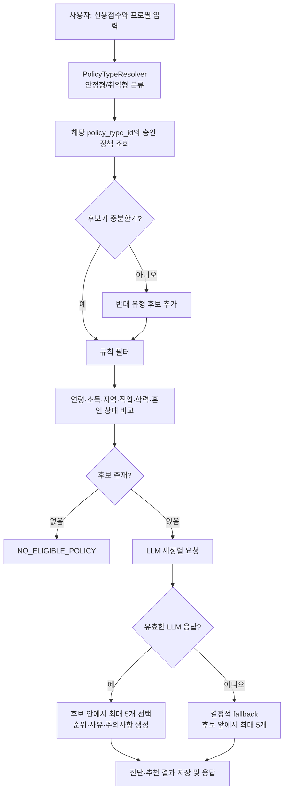

# 정책 추천 구현 흐름

이 문서는 현재 백엔드의 `DiagnoseService`와 정책 데이터 필드를 기준으로, 사용자가 어떤 방식으로 정책 추천을 받는지 설명한다.

## 핵심 원칙

- 코드가 먼저 연령, 소득, 지역, 직업, 학력, 혼인 상태로 후보 정책을 줄인다.
- LLM은 이 후보 목록 밖의 정책을 새로 추천하지 않고, 후보 안에서 순위·추천 사유·주의사항을 만든다.
- LLM 호출에 실패하면 후보 목록 순서대로 최대 5개를 반환한다.

## 예시 입력

```json
{
  "creditScore": 720,
  "userInputsOverride": {
    "age": 27,
    "annualIncome": 32000000,
    "regionCode": "26",
    "jobCode": "0013010",
    "schoolCode": "0049010",
    "marriageCode": "0055003"
  }
}
```

위 값은 현재 API가 받는 필드 형태를 따른 예시다. 정책 데이터에는 온통청년 원본의 `sprtTrgtMinAge`, `sprtTrgtMaxAge`, `earnMinAmt`, `earnMaxAmt`, `zipCd`, `jobCd`, `schoolCd`, `mrgSttsCd`가 저장된다.

## 후보 정책 예시

정제 데이터에는 `부산 청년 월세 지원`처럼 연령 조건(예: 19~34세), 지역 조건, 소득 조건을 가진 정책이 포함된다. 현재 서버는 정책 한 건에서 아래 필드를 읽어 후보를 판단한다.

```json
{
  "plcyNo": "P-EXAMPLE-001",
  "plcyNm": "부산 청년 월세 지원",
  "sprtTrgtMinAge": 19,
  "sprtTrgtMaxAge": 34,
  "earnMinAmt": "0",
  "earnMaxAmt": "40000000",
  "zipCd": "26...",
  "jobCd": "0013010",
  "schoolCd": "0049010",
  "mrgSttsCd": "0055003",
  "plcySprtCn": "청년 주거비 지원",
  "addAplyQlfcCndCn": "추가 자격 요건",
  "ptcpPrpTrgtCn": "지원 제외 조건"
}
```

`P-EXAMPLE-001`은 문서 설명용 식별자다. 실제 데이터의 정책명·조건 필드는 온통청년 정책 데이터에서 온다.

## 처리 흐름



## 1. 사용자 유형 분류

`creditScore`는 `PolicyTypeResolver`에서 `STABLE` 또는 `VULNERABLE`로 바뀐다. 각 유형은 설정값의 `stable-policy-type-id` 또는 `vulnerable-policy-type-id`와 연결된다.

## 2. 규칙 기반 후보 필터

후보 정책은 다음을 모두 통과해야 한다.

| 사용자 입력 | 정책 필드 | 판정 |
| --- | --- | --- |
| 나이 | `sprtTrgtMinAge`, `sprtTrgtMaxAge` | 범위 안인지 확인 |
| 연 소득 | `earnMinAmt`, `earnMaxAmt` | 숫자를 추출해 범위 비교 |
| 지역 | `zipCd` | 입력 코드 포함 여부 |
| 직업 | `jobCd` | 입력 코드 포함 여부 |
| 학력 | `schoolCd` | 입력 코드 포함 여부 |
| 혼인 상태 | `mrgSttsCd` | 입력 코드 포함 여부 |

예시 사용자는 27세·연 소득 3,200만 원이므로, 위 예시 정책의 19~34세 및 최대 4,000만 원 조건은 통과한다. 이후 지역·직업·학력·혼인 코드도 정책 조건과 맞아야 최종 후보가 된다.

## 3. LLM 재정렬

후보가 남으면 `OpenAiPolicyReranker`가 OpenAI 호환 `/chat/completions` API에 다음 정보를 보낸다.

- 사용자 유형과 신용점수
- 연령대와 소득 구간
- 지역·직업·학력·혼인 코드
- 각 후보의 정책번호, 이름, 설명, 지원 내용, 추가 자격, 제외 조건

응답 스키마는 `plcyNo`, `rank`, `reason`, `caution`으로 고정된다. 서버는 반환된 `plcyNo`가 전달한 후보에 실제로 있는지 다시 확인한다. 후보 밖의 정책번호는 버린다.

## 4. 실패 시 동작

OpenAI API 키가 없거나 요청·응답 검증이 실패하면 서버는 예외를 사용자에게 그대로 노출하지 않는다. `Policy rerank unavailable; using deterministic fallback` 로그를 남기고, 필터를 통과한 후보에서 최대 5개를 순서대로 반환한다.

## 확인 방법

1. `spring.ai.openai.api-key`를 설정한다.
2. 추천 API를 호출한다.
3. 서버 로그에 fallback 경고가 없고 OpenAI 호출 성공 로그가 있으면 LLM 재정렬이 수행된 것이다.
4. API 키를 비우거나 LLM endpoint를 일시적으로 차단하면 같은 후보군에서 fallback 응답이 반환되는지 확인한다.
