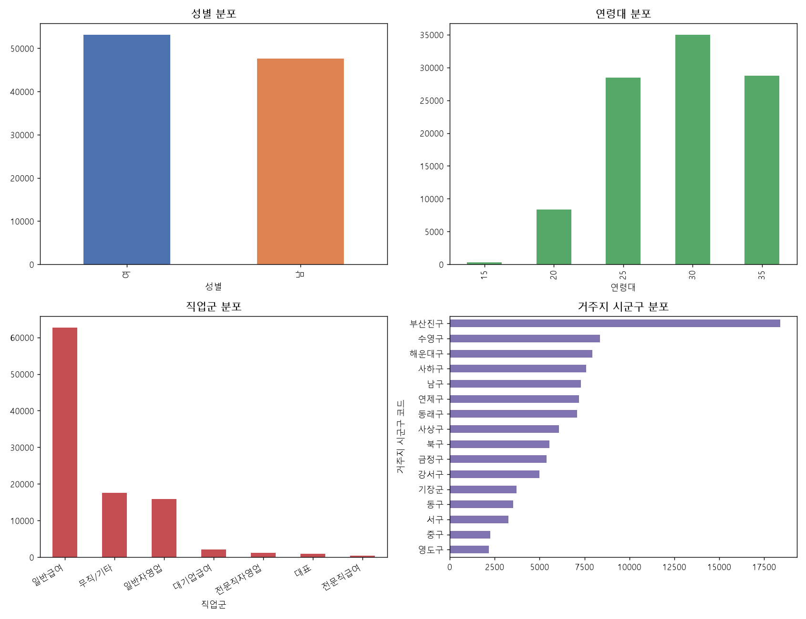
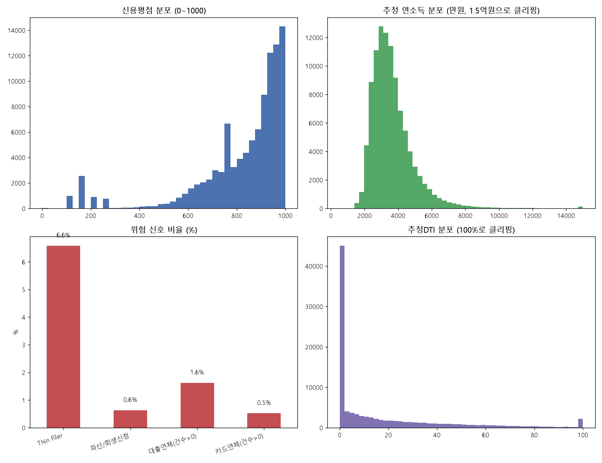
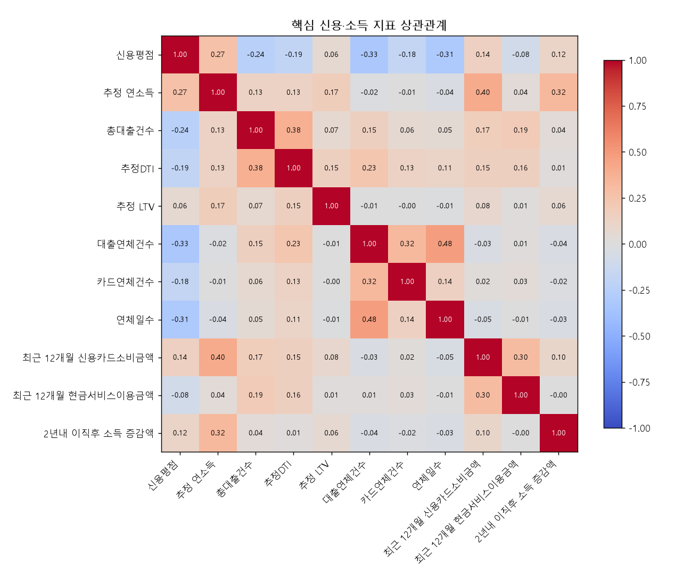
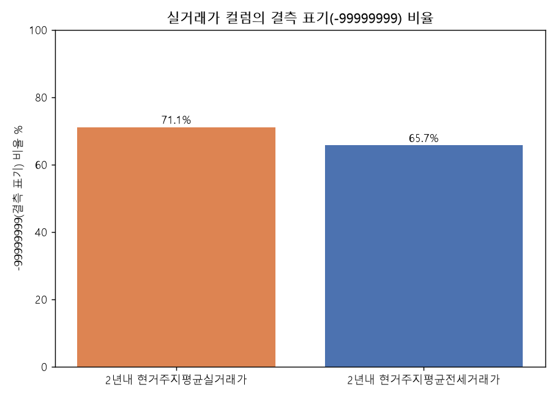

# (합성데이터)종합해커톤.csv 분석 리포트

- 파일: `important data/(합성데이터)종합해커톤.csv`
- 크기: 100,816행 × 42열 (약 15.8MB)
- 참고 문서: `데이터사용컬럼정의서.xlsx` (데이터명세 42건 + 코드 시트)
- 결측치(NaN): 없음 / 완전 중복행: 없음

## 1. 핵심 요약

1. **컬럼이 42개로, 기존에 파악하고 있던 "KCB 필수 43개 필드"보다 1개 적습니다.** `LLM service/reports/integration_guide.md`의 `kcb_record` 예시에 있던 **`추정가구원수`가 이 파일에는 없습니다.** 이 필드는 현재 서비스의 1인가구 판정(`추정가구원수=1` 필터링, 1인가구 상세 소비피드백)에 직접 쓰이는 값이라, 이 42개 컬럼만으로는 1인가구 여부를 못 가립니다. 최종 공식 데이터에 포함되는지 KCB 쪽에 확인이 필요합니다.

2. **`2년내 현거주지평균실거래가`(71.1%), `2년내 현거주지평균전세거래가`(65.7%)는 결측치를 `-99999999`로 표기**하고 있습니다(NaN이 아니라 sentinel 값). 이 두 필드는 실질적으로 3명 중 2명꼴로 값이 없다고 보면 됩니다. 기존 문서에서도 "임의 변환하지 않는다"고 명시해뒀던 부분과 일치합니다.

3. **`최근 12개월 일시불이용금액` + `최근 12개월 할부이용금액`이 `최근 12개월 신용카드소비금액`을 초과하는 행이 76.7%(77,341건)** 입니다. 정의상 일시불·할부는 신용카드소비금액의 하위 항목이어야 하므로(둘의 합이 전체를 넘을 수 없음), 합성 로직상의 정합성 오류로 보입니다. 평균 초과폭은 약 10,850(단위: 원자료 그대로, 천원 추정). 공식 데이터에서도 재현되는지, 아니면 이번 합성 배치만의 문제인지 확인이 필요합니다.

4. **위험 신호 비율**: Thin Filer 6.59%(6,639명), 파산/개인회생 신청 0.63%(636명), 대출연체 발생 1.63%(1,639명), 카드연체 발생 0.52%(529명). 대부분 정상 범주이고 위험군 비율은 낮게 설계되어 있습니다.

5. **신용평점 분포에 특이 스파이크**가 있습니다(150~200점대, 750~780점대 구간에 도수가 튐 — 자세한 건 2번 차트 참고). 신용평점 0점인 행이 28건 있는데 이 중 Thin Filer와 겹치는 건 1건뿐이라, 나머지 27건은 "이력은 있는데 0점"인 상태로 해석에 주의가 필요합니다.

6. **지역 코드가 정확히 부산 16개 구·군**(중구~기장군, `26110`~`26710`)으로만 구성되어 있어, 이전에 논의했던 "외부 공공데이터(인구통계·실거래가)와의 지역코드 정합" 작업에 그대로 쓸 수 있는 코드-구명 매핑표가 확보됐습니다(§3 참고).

## 2. 컬럼 상세 (42개 전체)

고유값·최소·최대·평균은 이 100,816행 표본 기준입니다. 금액 단위는 정의서에 별도 표기가 없어 원자료 그대로(추정 KCB 관행상 대부분 천원 단위로 추정, 최종 확인 필요) 실었습니다.

| # | 컬럼명 | 자료형태 | 고유값 | 최소 | 최대 | 평균 | 설명 |
|---|---|---|---|---|---|---|---|
| 1 | 성별 | 범주형 | 2 | 1 | 2 | 1.53 | 성별 구분 |
| 2 | 연령대 | 범주형 | 5 | 15 | 35 | 29.14 | 5세단위 연령, 기준연월 만나이 기준. 18~19세 분리 및 75세이상 세분화 |
| 3 | 직업군 | 범주형 | 7 | 410 | 910 | 521.04 | KCB 등록 직장정보 기반 대표 직업군 (법인대표>자영업자>급여소득>기타 순 산출) |
| 4 | 거주지 시군구 코드 | 범주형 | 16 | 26,110 | 26,710 | 26,348.99 | 기준시점 등록된 거주지 시군구코드 |
| 5 | 근무지 시군구 코드 | 범주형 | 16 | 26,110 | 26,710 | 26,346.54 | 기준시점 등록된 근무지 시군구코드 |
| 6 | 추정월소득 | 수치형 | 204 | 1,083 | 21,667 | 3,164.63 | KCB 추정소득모형(직업군별 월카드사용액 등 반영) |
| 7 | 증빙연소득 | 수치형 | 7,077 | 0 | 620,340 | 13,398.17 | 금융거래시 증빙한 연소득(국세청 연말정산 등), 증빙없으면 0 |
| 8 | 추정 연소득 | 수치형 | 6,241 | 5,168 | 252,996 | 36,555.78 | 추정월소득의 최근 12개월 합 |
| 9 | 2년전 추정 연소득 금액 | 수치형 | 5,901 | 0 | 219,499 | 32,570.48 | 추정월소득의 2년전부터 과거 12개월 합 |
| 10 | 총자산평가금액(주택) | 수치형 | 15,245 | 0 | 2,527,915 | 171,981.93 | 보유/거주주택 기준 추정 자산평가액(실거래가 2년 평균) |
| 11 | 순자산평가금액(주택) | 수치형 | 20,650 | 0 | 2,389,240 | 141,891.09 | 총자산평가금액(주택) - 주택담보대출 |
| 12 | 자가거주여부 | 범주형 | 3 | 0 | 3 | 2.86 | 본인 소유 주택 거주시 1 (0/1/3만 관측, 2는 미관측) |
| 13 | 현 거주지의 아파트여부 | 범주형 | 2 | 0 | 1 | 0.48 | 아파트면 1 |
| 14 | 현 거주지의 매매가(실거래가/공시가격) | 수치형 | 12,462 | 0 | 3,746,660 | 292,946.88 | 실거래가 2년 평균 |
| 15 | 차량보유(국산/수입) | 범주형 | 3 | 0 | 2 | 0.15 | 국산/수입차 구분 |
| 16 | 추정 LTV | 수치형 | 243 | 0 | 4 | 0.02 | 주택담보대출잔액/주택평균매매가 |
| 17 | 추정DTI | 수치형 | 1,824 | 0 | 483 | 18.32 | 주택담보대출 상환액(원금+이자)/추정연소득 |
| 18 | 신용평점 | 수치형 | 722 | 0 | 1,000 | 822.59 | 개인 신용평점(0~1,000), 높을수록 우량 |
| 19 | 총대출건수 | 수치형 | 23 | 0 | 22 | 1.21 | 대출 건수 총합 |
| 20 | 신용대출-총대출약정액 | 수치형 | 3,664 | 0 | 540,000 | 10,229.48 | |
| 21 | 신용대출-총대출잔액 | 수치형 | 18,600 | 0 | 400,000 | 7,242.25 | |
| 22 | 주택담보대출-총대출약정액 | 수치형 | 1,497 | 0 | 1,539,000 | 19,177.17 | |
| 23 | 주택담보대출-총대출잔액 | 수치형 | 6,756 | 0 | 1,270,000 | 16,961.38 | |
| 24 | 정책자금대출-총대출약정액 | 수치형 | 230 | 0 | 700,000 | 586.75 | |
| 25 | 정책자금대출-총대출잔액 | 수치형 | 335 | 0 | 617,853 | 441.85 | |
| 26 | 총 대출 상환금액(최근 12개월) | 수치형 | 19,596 | 0 | 328,622 | 4,679.63 | 원금+이자 합계 |
| 27 | 최근 12개월 신용카드소비금액 | 수치형 | 41,207 | 0 | 531,590 | 19,310.59 | |
| 28 | 최근 12개월 체크카드소비금액 | 수치형 | 22,270 | 0 | 64,546 | 6,923.25 | |
| 29 | 최근 12개월 일시불이용금액 | 수치형 | 39,954 | 0 | 368,795 | 20,836.19 | ⚠ §1-3 정합성 이슈 참고 |
| 30 | 최근 12개월 할부이용금액 | 수치형 | 18,539 | 0 | 184,919 | 4,348.75 | ⚠ §1-3 정합성 이슈 참고 |
| 31 | 최근 12개월 현금서비스이용금액 | 수치형 | 2,839 | 0 | 252,400 | 928.71 | |
| 32 | 대출연체건수 | 수치형 | 12 | 0 | 12 | 0.03 | 월말기준 |
| 33 | 카드연체건수 | 수치형 | 8 | 0 | 7 | 0.01 | 월말기준 |
| 34 | 연체일수 | 수치형 | 593 | 0 | 2,439 | 6.39 | 보유연체 연체일수 합산 |
| 35 | 대출연체금액 | 수치형 | 1,444 | 0 | 626,959 | 240.70 | |
| 36 | 카드연체금액 | 수치형 | 494 | 0 | 58,850 | 20.03 | |
| 37 | Thin Filer 여부 | 범주형 | 2 | 0 | 1 | 0.07 | 3년내 대출·카드 이력 없어 신용점수 산출 불가 |
| 38 | 파산, 개인회생 신청 여부 | 범주형 | 2 | 0 | 1 | 0.01 | 0=아님, 1=신청자 |
| 39 | 2년내 현거주지평균실거래가 | 수치형 | 2,979 | -99,999,999 | 277,000 | -71,062,792.88 | ⚠ 71.1% sentinel(-99999999) |
| 40 | 2년내 현거주지평균전세거래가 | 수치형 | 2,296 | -99,999,999 | 113,000 | -65,651,956.97 | ⚠ 65.7% sentinel(-99999999) |
| 41 | 2년내 직장명이력건수 | 수치형 | 6 | 0 | 5 | 0.70 | 최근 2년 직장명 변경 건수 |
| 42 | 2년내 이직후 소득 증감액 | 수치형 | 230 | -6,333 | 8,916 | 244.51 | 기준시점-2년전 월추정소득 차, 이력없으면 0 |

**주의**: 39, 40번 컬럼의 최소/평균은 `-99999999` sentinel이 그대로 섞여 계산된 값이라 의미가 없습니다. 실제 사용 시 반드시 sentinel을 결측 처리 후 계산해야 합니다.

## 3. 코드 참고표

### 거주지/근무지 시군구 코드 (부산 16개 구·군)

| 코드 | 구·군명 | 코드 | 구·군명 |
|---|---|---|---|
| 26110 | 중구 | 26410 | 금정구 |
| 26140 | 서구 | 26440 | 강서구 |
| 26170 | 동구 | 26470 | 연제구 |
| 26200 | 영도구 | 26500 | 수영구 |
| 26230 | 부산진구 | 26530 | 사상구 |
| 26260 | 동래구 | 26710 | 기장군 |
| 26290 | 남구 | | |
| 26320 | 북구 | | |
| 26350 | 해운대구 | | |
| 26380 | 사하구 | | |

### 직업군 코드

| 코드 | 의미 |
|---|---|
| 410 | 대기업급여소득 |
| 420 | 일반급여소득 |
| 430 | 전문직급여소득 |
| 440 | 대표 |
| 510 | 일반자영업 |
| 520 | 전문직자영업 |
| 910 | 무직/기타 |

## 4. 시각화

### 4.1 인구통계 분포 (성별·연령대·직업군·거주지)

- 성별은 여 52.7% / 남 47.3%로 큰 편차 없음
- 연령대는 30세 구간이 최다(34,979건), 15세 구간은 260건뿐으로 표본이 매우 적음
- 직업군은 일반급여소득이 62%로 압도적, 대표·전문직은 희소
- 거주지는 부산진구가 18,301건으로 가장 많고 영도구가 가장 적음(2,090건) — 실제 인구비례와 대략 맞는 패턴

### 4.2 신용·소득·위험 지표

- 신용평점은 800~1000점대에 몰려있는 우량 편향 분포이며 150~200점, 750~780점 구간에 부자연스러운 스파이크가 있음(§1-5)
- 추정 연소득은 3,000~4,000만원대가 최빈구간, 우측 꼬리가 긴 전형적 소득분포
- 위험신호 비율은 모두 한 자릿수 %대로 낮게 설계됨
- 추정DTI는 0 근처에 집중, 100% 초과가 2,014건(2.0%), 최대 483%까지 존재(차트는 표시를 위해 100%에서 클리핑)

### 4.3 핵심 지표 상관관계

- 신용평점은 대출연체건수(-0.33), 연체일수(-0.31), 총대출건수(-0.24)와 뚜렷한 음의 상관 — 연체·다중대출이 많을수록 신용평점이 낮아지는 합리적 패턴
- 추정연소득은 신용카드소비금액(0.40), 이직후 소득증감액(0.32)과 양의 상관
- 총대출건수-추정DTI(0.38), 대출연체건수-연체일수(0.48), 대출연체건수-카드연체건수(0.32)도 상식적인 수준의 상관관계

### 4.4 실거래가 컬럼 결측(sentinel) 비율

## 5. 확인이 필요한 사항 (팀/KCB 문의용)

- [ ] `추정가구원수` 필드가 최종 공식 데이터에는 포함되는지 (1인가구 판정 로직에 필수)
- [ ] 일시불+할부이용금액이 신용카드소비금액을 초과하는 76.7% 사례가 합성 로직 버그인지, 공식 데이터에도 재현되는지
- [ ] 신용평점 150~200점대·750~780점대 스파이크, 0점 28건의 원인
- [ ] 금액 단위(원 vs 천원) 최종 확인 — 기존 `LLM service` 파이프라인은 천원 단위를 가정하고 있음
- [ ] `자가거주여부` 코드 2가 이 배치에서 관측되지 않은 이유(코드 정의 자체에 없는 값인지, 이번 표본에서 우연히 빠진 것인지)

---
*생성: Claude Code 분석, 원본 `important data/(합성데이터)종합해커톤.csv` 기준*
